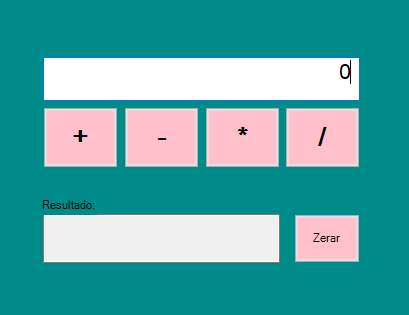

# calculadora.NET
simple calculator application using C# | Windows Forms | .NET framework | Class Library | with operations: sum, subtraction, division, multiplication and clear | CIGAM DEVs ⏳

### Funcionalidades: 
- [x] Calcular 4 operações matemáticas básicas: Somar, Subtrair, Multiplicar e Dividir.

### 🎨 Screen

   

 

### 🛠 Ferramentas utilizadas
- Visual Studio 2022: .Net Framework
- Magic XPA 4.7

#

##### :orange_circle: Cigam DEVs

 

:date: 2022
